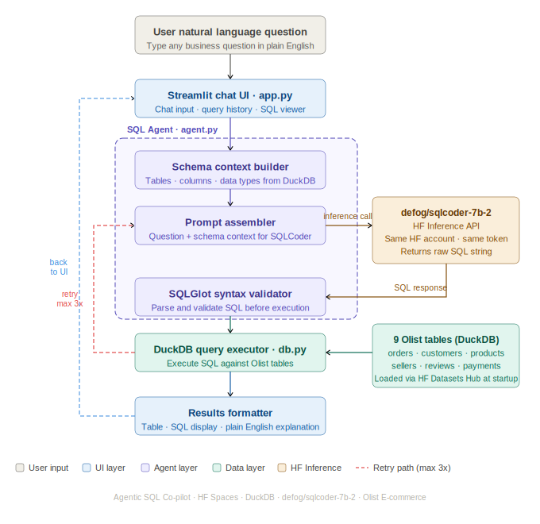

# Agentic SQL Co-pilot

A production-oriented Text-to-SQL agent that converts natural language business questions into executable SQL queries, runs them against any structured CSV dataset, and self-corrects on errors without human intervention.

**Live demo:** [huggingface.co/spaces/pranshu1921/sql-copilot](https://huggingface.co/spaces/pranshu1921/sql-copilot)

---

## Overview

Translating business questions into SQL is one of the most frequent bottlenecks in data-driven organisations. Analysts wait hours or days for ad-hoc queries. This project addresses that gap with an agent that accepts plain English input, generates syntactically valid DuckDB SQL, executes it against any loaded dataset, and delivers structured results with a plain English interpretation.

The system is designed around four production-relevant concerns that most portfolio Text-to-SQL projects ignore: schema-awareness at runtime, failure recovery through a self-correction loop, automatic column location fixing via AST rewriting, and dataset-agnostic design that works on any CSV data without code changes.

---

## System Architecture



The architecture is a single deployment unit running on Hugging Face Spaces. There is no separate backend server, no database host, and no infrastructure to manage.

**Request flow:**

1. The user types a natural language question into the Streamlit chat interface.
2. The schema context builder reads all table names, column names, data types, sample rows, and inferred join keys from DuckDB at runtime.
3. The prompt assembler combines the user question with the full schema context.
4. The prompt is sent to `Qwen/Qwen2.5-Coder-7B-Instruct` via the HF Inference API.
5. The returned SQL passes through two post-processing steps: alias stripping (SQLGlot AST rewrite) and column table fixing (verifies every column reference against the real schema).
6. SQLGlot validates the rewritten SQL for syntax errors before hitting the database.
7. DuckDB executes the validated SQL against the in-memory tables.
8. If execution fails, the error message is injected back into the next prompt and the cycle repeats up to three times.
9. On success, a second model call generates a plain English explanation of the result.
10. The Streamlit UI renders the SQL, results table, explanation, and self-correction log if retries occurred.

---

## Tech Stack

| Component | Technology | Rationale |
|---|---|---|
| LLM | Qwen/Qwen2.5-Coder-7B-Instruct | Strong code and SQL generation. Free via HF Inference API. Fast on the free tier. |
| SQL engine | DuckDB 0.10 | In-process, zero-config, reads structured data without ETL. Columnar storage for fast analytical queries. |
| Dataset | Olist E-commerce (local CSV) | Nine relational tables, 100k orders, 1.55M total rows. Ships with the repo. |
| SQL validation | SQLGlot | Dialect-aware syntax checking and AST transformation for alias stripping and column fixing. |
| UI | Streamlit | Chat interface with session history, schema explorer, example questions, retry log, query counter. |
| Deployment | Hugging Face Spaces | Always-on free tier. No sleep timeout. Public URL at first push. |

---

## Key Features

### Self-correcting agent loop

When a query fails execution, the error message is injected into the next prompt as context. The loop runs up to three times. Each attempt and its error are recorded and surfaced in the UI as a self-correction log.

### Alias stripping via SQLGlot AST

The model frequently generates table aliases (`SELECT o.order_id FROM orders o`). Rather than fighting this with prompt instructions, SQLGlot parses the SQL into an AST, builds an alias-to-table map, and rewrites every aliased column reference to use the full table name before execution. This runs deterministically regardless of what the model generates.

### Column table fixing

After alias stripping, a second AST pass checks every `table.column` reference against the real DuckDB schema. If a column is assigned to the wrong table (a common LLM error), the pass looks up which table actually contains that column and rewrites the reference. This eliminates the most common class of execution errors entirely.

### Runtime schema injection

The schema context is built fresh from DuckDB metadata on each agent instantiation. It includes CREATE TABLE definitions, one sample row per table, a unique column location guide, and relationship hints. The sample rows and column guide are what make multi-table join generation reliable.

### Dataset-agnostic design

No table names, column names, or join paths are hardcoded anywhere in the application. The schema context builder discovers everything at runtime from whatever CSV files are present in the `data/` folder.

---

## Bring Your Own Data

This is not a demo built around a specific dataset. It is a reusable SQL intelligence layer that works on any structured CSV data.

**To use your own data:**

1. Remove the existing CSV files from `data/`
2. Drop your own CSV files into `data/` — any number, any schema
3. Optionally create `data/relationships.txt` with join keys in this format:
   ```
   orders.customer_id = customers.customer_id
   order_items.order_id = orders.order_id
   ```
4. Optionally drop an ERD image (PNG or JPG) into `data/` — the app extracts relationships automatically on first run
5. Restart the app

Each CSV file becomes a queryable DuckDB table named after the filename. A business with orders, customers, and products in spreadsheets can be running natural language queries against their own data in under five minutes, with no code changes and no database setup.

---

## Dataset: Olist Brazilian E-commerce

The Olist dataset is a real transaction record from a Brazilian e-commerce platform covering 2016 to 2018. It ships with this repo in the `data/` folder.

| Table | Rows | Description |
|---|---|---|
| olist_orders_dataset | 99,441 | Order lifecycle: status, timestamps, estimated delivery |
| olist_order_items_dataset | 112,650 | Products per order with price and freight value |
| olist_order_payments_dataset | 103,886 | Payment method, installments, and value |
| olist_order_reviews_dataset | 99,224 | Customer review scores and comment text |
| olist_customers_dataset | 99,441 | Customer city, state, and zip code |
| olist_products_dataset | 32,951 | Product category, dimensions, and weight |
| olist_sellers_dataset | 3,095 | Seller city, state, and zip code |
| olist_geolocation_dataset | 1,000,163 | Zip code to latitude/longitude mapping |
| product_category_name_translation | 71 | Portuguese to English category name translation |

---

## Project Structure

```
sql-copilot/
├── app.py                  Streamlit application and UI
├── agent.py                SQL agent: generation, validation, AST fixing, explanation
├── db.py                   DuckDB connection, CSV loading, relationship hints
├── requirements.txt        Pinned Python dependencies
├── .env.example            Template for local environment variables
├── .gitignore
├── data/
│   ├── *.csv               Olist dataset files (or your own CSV files)
│   └── relationships.txt   Explicit join key definitions
├── assets/
│   └── architecture.svg    System architecture diagram
└── README.md
```

---

## Screenshots

**Main chat interface**

> Add a screenshot of the chat UI here after your first successful run.
> Save as `assets/screenshot_chat.png` and replace this with:
> ``

**Self-correction in action**

> Add a screenshot showing the retry log expanded after a self-correction.
> Save as `assets/screenshot_retry.png`.

**Schema explorer**

> Add a screenshot of the sidebar with a table selected.
> Save as `assets/screenshot_schema.png`.

---

## Example Queries

**Single table aggregation:**
> How many orders are in the dataset?

> What are the different order statuses and how many orders are in each?

**Two table join:**
> Which cities have the most customers?

> What are the top 10 sellers by number of orders fulfilled?

**Multi-table join:**
> What are the top 10 product categories by total revenue?

> Which product categories have the highest average review score?

**Time-series:**
> What is the monthly order volume trend across 2017 and 2018?

**Business insight:**
> Which sellers have the highest average review score with at least 50 orders?

---

## Technical Decisions

### Why DuckDB over SQLite or PostgreSQL

DuckDB runs in-process inside the Python application. There is no server to start, no connection string to configure, and no port to expose. A pandas DataFrame becomes a queryable table in one line: `con.register(table_name, df)`. No ETL pipeline. No schema creation scripts. For analytical workloads with aggregations and joins across 100k-row tables, DuckDB's columnar storage engine is materially faster than SQLite's row-based design.

### Why AST rewriting over prompt engineering

Early versions of this agent relied on prompt instructions to control alias usage and column placement. The model consistently ignored them. SQLGlot's AST transformation is deterministic — it rewrites the SQL regardless of what the model generates. The combination of alias stripping and column table fixing eliminates the two most common classes of LLM SQL errors at the post-processing layer rather than the generation layer.

### Why dataset-agnostic design

Hardcoding table names and join paths is the single biggest reason most Text-to-SQL portfolio projects cannot be used outside their demo scenario. By discovering schema, relationships, and column locations at runtime, this system works identically on the Olist dataset, a retail database, a SaaS metrics export, or any other structured CSV data. The `relationships.txt` and ERD image support makes onboarding a new dataset a five-minute task rather than a code change.

### Why HF Spaces over Streamlit Community Cloud

Streamlit Community Cloud pauses applications after seven days without traffic. HF Spaces free tier does not have a sleep policy. The application is running when the link is clicked, regardless of traffic history.

---

## Local Development

See [RUNNING.md](RUNNING.md) for full step-by-step instructions.

Quick start:

```bash
git clone https://github.com/pranshu1921/sql-copilot.git
cd sql-copilot
conda create -n sql-copilot python=3.11 -y
conda activate sql-copilot
pip install -r requirements.txt
cp .env.example .env          # add your HF_TOKEN
streamlit run app.py
```

---

## Deployment to Hugging Face Spaces

Full deployment steps are in [RUNNING.md](RUNNING.md).

1. Create a new Space at huggingface.co/spaces (SDK: Streamlit)
2. Add `HF_TOKEN` to Space Settings > Secrets
3. Push this repository to the Space's git remote
4. HF builds and serves the application automatically

```bash
git remote add hfspace https://huggingface.co/spaces/YOUR_HF_USERNAME/sql-copilot
git push hfspace main
```

---

## Author

**Pranshu Kumar**
Data Scientist with experience building production ML and GenAI systems across energy, telecommunications, and technology sectors.

- LinkedIn: [linkedin.com/in/pranshu-kumar](https://www.linkedin.com/in/pranshu-kumar)
- GitHub: [github.com/pranshu1921](https://github.com/pranshu1921)
- Email: pranshukumarpremi@gmail.com

---

## License

MIT
